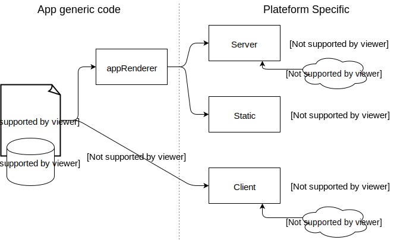

# A *no-js* app with *React* and *Redux*

---

### No-JS ?
___

* Write a web app in full JavaScript
* Works without JavaScript.

note:

An app that will be :
* Using different server side rendering techniques
* JS server + client = DRY

---

### Samuel Bouchet

Freelance - JavaScript developer and architect

[samuel-bouchet.fr](http://samuel-bouchet.fr/)

[@Lythom](https://twitter.com/Lythom)


---

### Overview of the architecture ###

---



---

### Why
#### Client side rich application
___

Improve User Experience (dynamic features, fast, offline)

---

### Why
#### Server side rendering
note: mode single page application full client
___

Improve User Experience (First display is earlier)
*Only if (server time to render) < (client time to download + time to init)*
___

SEO (everybody says that so it must be true)
___

(+) Reduce the server network load (less requests if data is pre-fetched and cached server side)
note: allowed by, but not inheritent to, ssr
___

(+) Improve the user experience (provide the service server side if the client cannot)
* Before load
* Compatibility fallback
* People that disable js on purpose
* Improve Accessibility
* Robots that can perform actions for people (assistance, delegated use, integration tests)
note:
for older browers (ie6, ie7, ie8, olders android, windows phones)
You might even want to ship an es6 app

i18n  
* Force you to create proper forms / html components / links
* Accessibility tools can perform actions by querying the server

integration ex: superagent (Cf. conf Alvin Berthelot)
___

(+) Resilience
* Support server overload / fails by serving a static prerendered (from CDN, nginx, etc.)
* Support client fail (inclusiveness, client app js error)
* Both fails = still a static page that indicate that interactions are currently unavailable.
    * Best experience is top-notch and Worst experience is decent

---

### Experience

* Shipped an app in production that showcase a google map + timed events

note:

* Confidential Article written in 2016-01 without the static part

---

## Demo
___

### Routing

* with js
* without js
* with js then a crash
* without server with js
* without server without js
___

### Counter

* with js
* without js
* with js then a crash
* without server with js
* without server without js
___

### Map

* with js
* without js
* with js then a crash
* without server with js
* without server without js

---

## Building the app

---

### Starting point
___

"create-react-app"
=    no SSR, hacky to add
___

"nwb"
=    no SSR, hacky to add
___

"kyt"
* =    ok for an universal starter
* /!\ Too much magic = lost of control, could do what I want
___

"next.js"
=    Didn't try (discovered too late) but could do
=    Add a complex frame around the projet
___

"enter your boilerplate here"
=    Does too many things
=    Miss some points, and because it does so many things the complexity is a real obstacle

---

### From scratch

---

#### The most basic server-side rendering
___
Install NodeJS latest stable
```
http://nodejs.org
```

Install express
```
npm install --save-dev express
```
___

```diff
+ src/server.js
+ src/client/index.js
+ package.json
```

package.json :
```json
"scripts": {
  "start" : "node src/server.js"
},
```

___
client/index.js :
```javascript
document.getElementById('root').innerHTML =
 "I'm client rendered ! with dynamic interactions !"
```

server.js :
```javascript
res.send(
  `<div id="root">
  I'm server rendered ! with static interactions !
  </div>
  <script src="index.js" />`
)
```

### Getting serious

---

### Server side counter
___

```
npm install --save shortid cookie-parser
```
___

server.js :
```Javascript
app.use(cookieParser())

app.get('*', function(req, res) {
  getSession(req.cookies.session)
  .then(sessionData => {
    // init store
    const store = createInitialStore(sessionData)

    if (!counter.selectors.isInitialized(store.getState().counter)) {
      store.dispatch(counter.actions.initCounterStart())
    }
    
    // save session state
    const sessionid = req.cookies.session || shortid.generate()
    setSession(sessionid, store.getState())
    
    // return response
    res.cookie('session', sessionid, { 
      maxAge : SESSION_DURATION, 
      secure : process.env.NODE_ENV !== 'development', 
      httpOnly : true
    })
    res.send(render())
  })
})
```

note:

Interesting example because force to use a session system.
Ex: Redis, PouchDB

___

app/component/CounterDemo.js :
```javascript
class CounterDemo extends React.PureComponent {

  componentDidMount() {
    this.interval = setInterval(this.forceUpdate.bind(this), 1000)
  }

  componentWillUnmount() {
    clearInterval(this.interval)
  }

  render() {/* … */}
}
function mapStateToProps(state) {/* … */}
export default connect(mapStateToProps)(CounterDemo)
```

___

```javascript
class CounterDemo extends React.PureComponent {
  componentDidMount() { /* … */}
  componentWillUnmount() { /* … */}
  render() {
    const intro = 'I\'m server rendered with react'
    if (this.props.hasStaticInteractions) 
      return <div>{intro}. Service is currently down, try again later !</div>

    const count = this.props.isCounterInitialized ? 
      Math.floor((Date.now() - this.props.counterStart) / 1000) : ''
      
    return (
        <div>
          {intro}. 
          Counting: {count} (test reload number : 40) 
          {this.props.hasServerInteractions === true && <Reload />} ! 
          with {this.props.interactions} interactions !
        </div>
    )
  }
}

function mapStateToProps(state) {/* … */}
export default connect(mapStateToProps)(CounterDemo)
```
___

```javascript
class CounterDemo extends React.PureComponent {
  componentDidMount() {/* … */}
  componentWillUnmount() {/* … */}
  render() {/* … */}
}

function mapStateToProps(state) {
  return {
    counterStart          : counter.selectors.getCounterStart(state.counter),
    isCounterInitialized  : counter.selectors.isInitialized(state.counter),
    hasStaticInteractions : interactions.selectors.isStatic(state.interactions),
    hasServerInteractions : interactions.selectors.isServer(state.interactions),
    interactions          : interactions.selectors.getInteractions(state.interactions)
  }
}

export default connect(mapStateToProps)(CounterDemo)
```

---

### server side openstreetmap

___

```diff
+ MapPage.js            -- Open Layer dynamic loading
+ MapList.js            -- Side list
+ MyMap.js              -- Layout / coordinator
+ olHelpers.js          -- manipulation of the Open Layer API
+ OLMap.js              -- Wrapper of the Open Layer imperative plugin
+ SelectionPopup.js     -- Description of the selection
+ umapDataSelectors.js  -- manipulation of the raw data
```

___

MapPage.js :
```javascript
class MapPage extends React.PureComponent {
  constructor() {/* … */}
  componentDidMount() {/* … */}
  render() {
    return <div>
      <Helmet>
        <link rel="stylesheet" href="https://openlayers.org/en/v4.1.1/css/ol.css" type="text/css"/>
        <script defer src="https://openlayers.org/en/v4.1.1/build/ol.js" type="text/javascript"/>
      </Helmet>
      <MyMap ol={this.state.openLayerLibrary} />
    </div>
  }
}
```

note:

injected in component to remove the "global" use

___

MapPage.js :
```javascript
class MapPage extends React.PureComponent {
    constructor() {
      super()
      this.state = {
        openLayerLibrary : MapPage.openLayerLibrary
      }
    }
    
    componentDidMount() {
      if (this.state.openLayerLibrary === null) {
        whenAvailable('ol').then((ol) => {
          MapPage.openLayerLibrary = ol
          this.setState({ openLayerLibrary : ol })
        })
      }
    }
    render() {/* … */}
}
```

note: 

* client side only
* loaded on demand to lighten the initial build

___

MyMap.js

```javascript
render() { return (
    <div>
      <FilterBar />
      <div className="pos-a">
        <OLMap umapData={this.props.data}
               ol={this.props.ol}
               popupContainer={this.state.popupContainer} />
        <SelectionPopup 
            umapData={this.props.data} 
            registerPopupContainer={this.registerPopupContainer} />
      </div>
      <MapList umapData={this.props.data} />
    </div>
)}
```
```javascript
export default withData(dataURL.umapData)(MyMap)
```

note:

* Removed CSS and stuff for clarity
* SelectionPopup is aside OLMap for server rendering, but used by OLMap. => popupContainer reference
* withData is universal, auto fetching OR from cache
    * client side : fetch on mount if the data is not loaded
    * server side : specific instruction to hydrate cache
* Possible to connect each of the 3 components instead of MyMap. But withData too raw.

___

OLMap.js :
```javascript
componentDidUpdate(prevProps, prevState) {
    if (prevProps.umapData !== this.props.umapData
      || prevProps.filter !== this.props.filter
      || prevProps.ol !== this.props.ol
      || prevState.mapContainer !== this.state.mapContainer) {
      this.updateMap()
    }
    if (prevProps.selectedFeature !== this.props.selectedFeature) {
      this.selectFeature(getFeatureByName(
        this.props.umapData.layers, 
        this.props.selectedFeature)
      )
    }
}
```

note:

* declarative to imperative programming. Listen to changes and react.
___

OLMap.js :
```javascript
import generateStaticMapURL from 'server/generateStaticMapURL'
// …
render() {
    const { umapData, filter } = this.props
    
    let mapURL = 'assets/mapPlaceholder.png'
    if (generateStaticMapURL && filter !== '') {
      mapURL = generateStaticMapURL(umapData.layers, filter)
    }
    
    return (
      <div ref={this.setMapContainer}>
        
      </div>
    )
}
```

note:

* server/generateStaticMapURL will be null client side (webpack alias)
    * because fallback server side only
    * remove unused dependencies by the client
    * use mapbox service, public token currently not hidden. TODO: proxy server side that append token.

___


MapList.js (button) :
```javascript
<form method="GET" action="">
    <button type={isStatic ? 'button' : 'submit'} 
            name="filter" value={feature.properties.name} 
            onClick={(e) => setFeature(e, feature.properties.name)}>
      <strong>{feature.properties.name}</strong><br/>
      {feature.properties.street} - {feature.properties.city}
      {isStatic && <div className="pt-1 d-n d-b:parent-focus">
        {feature.properties.description}
      </div>}
    </button>
</form>
```

note:

* button :
    * handle a click client side
    * submit a filter with dynamic interactions
    * only take focus with static interactions
    * Have a description on focus with static interactions

___

SelectionPopup.js :
```javascript
setPopupContainer(container) {
  const register = this.props.registerPopupContainer
  if (register) register(container)
}
render() { 
    const selection = getSelection(this.props)
    return (
    <div className="pos-a bgc-1 p-1 bd-2" ref={this.setPopupContainer}
       style={{
           display     : selection != null ? 'block' : 'none',
           left        : `calc(50% - 160px)`,
           bottom      : this.props.isDynamic ? 42 : `calc(50% + 44px)`,
           width       : 320,
           borderColor : getColor(this.props) }}>
    <strong>{selection && selection.name}</strong>
    <div>{selection && selection.description}</div>
    </div>
)}
```

note:

* setPopupContainer : way to transmit a dom reference to a brother (via parent)
* isDynamic : container = OL map
* isServer or isStatic : container = parent div the surround the map
* CSS design atomic

---

## going further

* Make the app work fully offline
    * real-time synchronization of Redux store using PouchDB
    * tabs and devices states are synchronized (not necessary navigation)
    * the app can go offline then synchronise back with custom conflict resolution where needed
    
* Make a generic server that automatically performs actions when client side js is disabled
    * Act as a front-end proxy
    * Ie. would use a pattern matching on url to dispatch any action

* Using static server by default for best performances and fallback on interactive server when needed.

---

## References

* [http://samuel-bouchet.fr](http://samuel-bouchet.fr/)
* The talk : [https://github.com/Lythom/talk-no-js-with-react-redux]()
* The demo repo : [https://github.com/Lythom/react-redux-nojs]()
* full-js and no-js article (FR, clever-age blog) [https://blog.clever-age.com/fr/2016/02/01/full-js-et-no-js-avecreactredux/]()